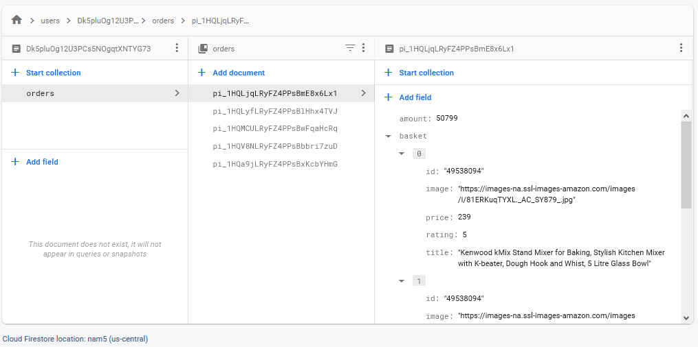
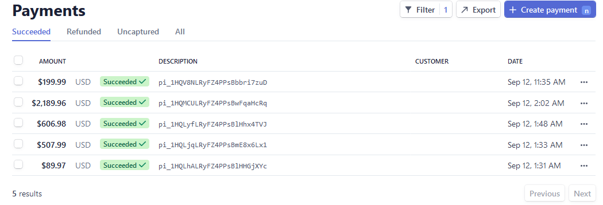

# Amazon clone
Amazon clone application with E-Commerce functionalities made with React.

## Description
This web application represents the front page of Amazon with full E-Commerce functionalities such as online basket management and payment processing. Application has login functionality and keeps track of customers and details of their orders.

## Implementation
Application is made in React using ES6 Hooks & Context API.

Material-UI and Flexbox are used for designing user interface that is similar to Amazon's.

Firebase is Google's platform used for all back-end functionalities of this application:  
 1. Application is hosted live on Firebase and can be accessed by clicking [here](https://clone-84d0e.web.app/).  
 2. Firebase cloud functions are used for providing API REST service. Checkout that part of project by clicking [here](/functions).  
 3. Database used for storing users' data and details about their orders is Cloud Firestore, provided from Firebase.  Cloud Firestore is a document based database which also has real time functionalities. Orders data stored within Firestore can be seen on the image below.
 

 
Payment API used in application is Stripe. It provides online payment processing for internet businesses. Next image shows details of test transactions made within application using Stripe.

 
IDE used for development is Visual Studio Code.
 
## Preview
Application can be accessed online by clicking [here](https://clone-84d0e.web.app/).  &#x1F6C8; _For creating user you can enter random (fake) email and password and for testing payment process, for the card information just enter digits 42 to the end of input._
